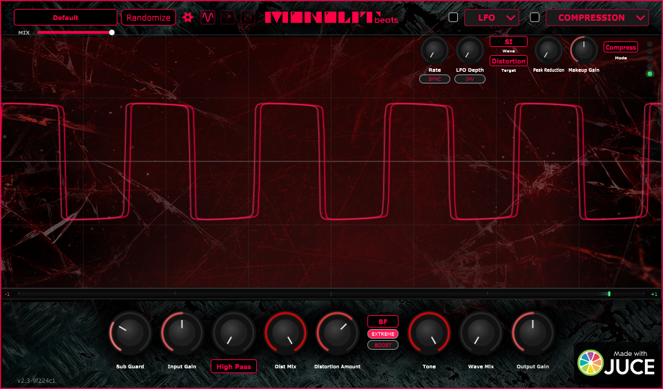

<div align="center">


# Sledge Distortion

**A distortion you shape by hand.** Draw the EQ curve straight onto the
oscilloscope instead of hunting through menus and numeric fields.

[](https://github.com/elarmuzik1993/Distortion/actions/workflows/build.yml)
[](LICENSE)




<sub>Shown with the "EXTREME" mode enabled</sub>

</div>

---

Sledge is a free, GPL-licensed distortion plugin built on [JUCE](https://juce.com).
Seven clip characters from tube warmth to outright destruction, an LA2A-style
optical compressor, tempo-syncable LFO routing, and a 12-band graphic EQ you
*draw* with the mouse — all in front of an oscilloscope that shows you what you
just did to the waveform.

It runs as **VST3** on Windows, macOS and Linux, plus **AU** and a **standalone
app** on macOS.

## Install

Grab the build for your platform from the
[latest release](https://github.com/elarmuzik1993/Distortion/releases/latest).
**[`INSTALL.md`](INSTALL.md) is the step-by-step guide** — per-platform
instructions, how to get past the unsigned-build prompts, and how to verify your
download against `SHA256SUMS`.

| Platform | What to run | Where it lands |
|---|---|---|
| **Windows** | `SledgeDistortion-<version>-Windows.exe` | `%CommonProgramFiles%\VST3\` |
| **macOS** | `SledgeDistortion-<version>-macOS.pkg` | VST3, AU → `/Library/Audio/Plug-Ins/`, app → `/Applications` |
| **Linux** | unpack the `.tar.gz` | `~/.vst3/` |

The Windows installer replaces any previous version cleanly and installs the
Microsoft VC++ runtime if the machine is missing it — required on clean
Windows 10 installs. If you use the plain ZIP instead, install
[the runtime](https://aka.ms/vs/17/release/vc_redist.x64.exe) yourself.

> **Builds are currently unsigned.** On Windows, SmartScreen shows an
> "unrecognised app" warning — **More info → Run anyway**, or use the ZIP, which
> avoids the prompt entirely. On macOS, right-click the `.pkg` → **Open**, then
> clear the quarantine flag — [`INSTALL.md`](INSTALL.md) has the exact commands.
> Code-signing is wired into CI and switches on when the certificates exist.

Requires 64-bit Windows 10+, macOS 11+, or a Linux distro with ALSA. ARM64
Windows works through x64 emulation; macOS builds are universal (arm64 +
x86_64).

## Features

**Distortion engine** — 7 clip types (Brutal Fuzz, Tube Overdrive, Bit Crusher,
Tape Saturation, Transformer Saturation, Diode Clipper, Decimator), polyphase IIR
oversampling at Off/2×/4×, a variable-slope Sub Guard crossover (50–200 Hz) that
keeps your low end out of the distortion, parallel Dist Mix, and true bypass
below 0.5% drive.

**Free-draw graphic EQ** — draw a magnitude response directly on the scope and it
becomes a 12-band peaking EQ (~30 Hz–16 kHz, ±12 dB) at the output stage. Fully
automatable, saved with presets, bit-transparent while flat, and one power button
mutes it click-free so you can A/B the curve you drew.

**Mono Input** — a bass or guitar on a single interface input lands on one side of a
stereo bus and plays out of one speaker. Sledge supports mono-in/stereo-out directly, and
where a host hands over a stereo bus anyway, the Mono Input switch in Settings centres the
source. It never engages on its own; when it spots a one-sided signal it just lights the
indicator in the title bar.

**Multimode input filter** — High-Pass / Low-Pass / Band-Pass (SVF TPT) ahead of
the drive. It runs in the true-bypass path too, so it doubles as a standalone
filter with distortion and compression switched off.

**Oscilloscope** — zero-crossing triggered so the waveform doesn't drift,
anti-alias decimated, and fed by a lock-free SPSC queue that never touches the
audio thread. One selector decides which overlay owns the surface: Off, XY Morph,
or the graphic EQ.

**LFO modulation** — 5 waveforms (sine, triangle, square, saw, random S&H) into 5
destinations (distortion amount, tone filter, hi-pass, dist mix, output gain),
free-running 0.1–50 Hz or BPM-synced to the host from 1/1 to 1/32 including
triplets, with polarity invert. Modulated knobs pulse so you can see the routing.

**LA2A-style compression** — optical cell envelope simulation with
program-dependent RMS tracking, 3:1 and 12:1 ratios, and 15% tube harmonics.

**Signal integrity** — auto-gain compensation, harmonic density scaling to keep
2–5 kHz from turning harsh, DC blocking, ISP soft clipping at −0.3 dBFS, a −0.5
dBFS output ceiling as the last gain stage, a phase-coherent Linear Phase Dry
path with no comb filtering at partial mix, and latency reported to the host for
PDC — re-imposed on the bypass path so toggling causes no timing jump.

16 factory presets. 3100+ test assertions, and every build is validated with
`pluginval` at strictness 10 on Windows and Linux, plus `auval` on macOS.

See [`CHANGELOG.md`](CHANGELOG.md) for what changed in each release.

## Build from source

You need CMake 3.22+ and a C++17 compiler. **JUCE 7.0.12 is fetched
automatically** at a pinned tag — you don't install it yourself.

```bash
cmake -B build -DCMAKE_BUILD_TYPE=Release
cmake --build build --target Distortion_VST3
```

On Linux, install `libasound2-dev` and `libcurl4-openssl-dev` first. On macOS
this produces a universal binary; add `-DCMAKE_OSX_ARCHITECTURES=arm64` for a
faster single-arch dev build. Run the tests with:

```bash
cmake --build build --target DistortionTests
./build/DistortionTests_artefacts/Debug/DistortionTests
```

```
Source/
├── PluginProcessor.cpp/h    # Audio processing
├── PluginEditor.cpp/h       # GUI
├── FactoryPresets.h         # Factory bank (single source of truth)
├── Diagnostics/             # Anonymous bug reporting (opt-out)
├── Tools/                   # Headless harnesses: render, soak, UI snapshot
└── Tests/                   # 3100+ assertions
```

## Contributing

Contributions are welcome — bug reports, DAW compatibility results, fixes,
features. **[`CONTRIBUTING.md`](CONTRIBUTING.md)** covers setup, the test and
validation steps a PR needs to pass, and the handful of rules that are
load-bearing rather than stylistic (no allocation in `processBlock`, no locks in
the scope path, and a new dependency brings its licence notice with it).

If you want the deep context, [`AGENTS.md`](AGENTS.md) is the project's source of
truth and [`docs/Architecture Contract.md`](docs/Architecture%20Contract.md)
defines the signal chain and what may not move within it.

If you're unsure whether an idea fits, open an issue and ask first — it's
cheaper than finding out in review. Starter-sized work gets labelled
`good first issue`.

## Privacy & bug reporting

Sledge Distortion can send **anonymous** bug reports (version, OS, host, sample
rate/block size, anomaly counts, a random install ID — no audio, no presets, no
file paths, no personal data). It is **on by default and opt-out**: a one-time
notice explains it on first launch, and you can switch it off any time in
**Settings → "Send anonymous bug reports"**.

Full details — exactly what is collected, when it's sent, and how to turn it off
— are in **[docs/PRIVACY.md](docs/PRIVACY.md)**.

## License

Sledge Distortion is free software, licensed under the
[GNU General Public License v3.0](LICENSE). You may use, study, modify and
redistribute it — including commercially — provided that derivative works are
also released under the GPL v3 and their source is made available.

The plugin is built on [JUCE](https://juce.com), whose GPL v3 option this
project takes, and it embeds the Orbitron typeface under the SIL Open Font
License 1.1. Full terms for every third-party component are in
**[THIRD-PARTY-NOTICES.md](THIRD-PARTY-NOTICES.md)**, which ships with every
binary release.

**Source code** for every released binary is this repository, at the tag
matching the version shown in the plugin's title bar.

### Pay what you want

Sledge Distortion is offered on a pay-what-you-want basis. The GPL guarantees
your freedom to use and share it whether you pay or not — what you are paying
for is prebuilt, ready-to-install binaries, continued development and support.
If it earns a place in your projects, paying keeps it being built.

To pay, or for anything else — commercial questions, bug reports you would
rather not file in the issue tracker, or licensing under other terms — get in
touch at **elar.muzik@gmail.com**.

---

Copyright © 2026 Boris Miscenco · [Monolit Beatz](https://monolitbeatz.com)
